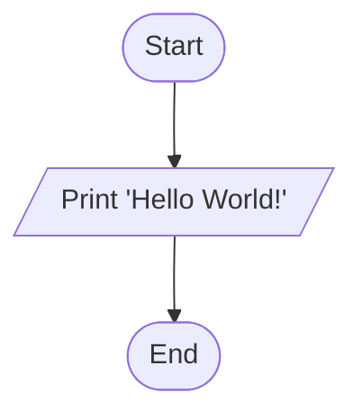
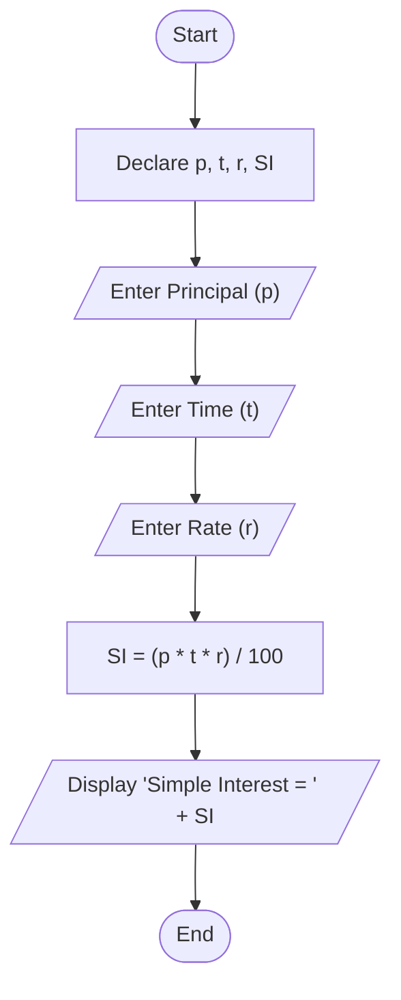
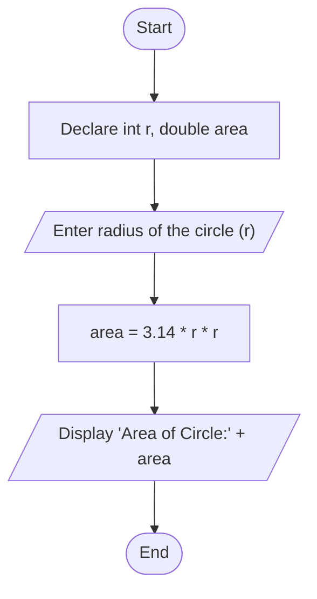
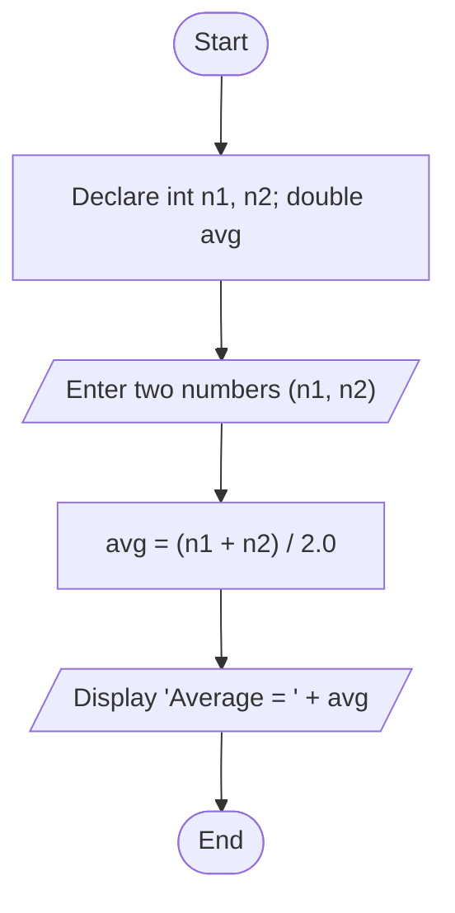
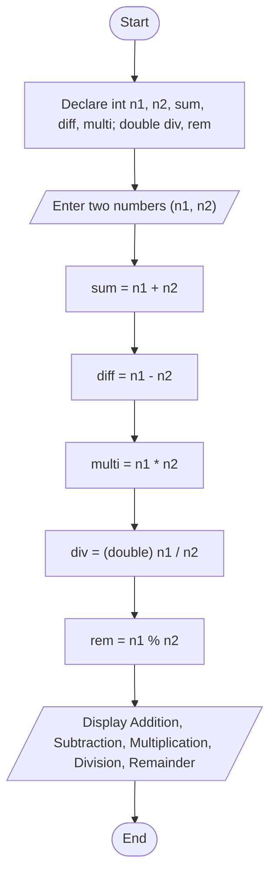

# learn_java - Flowcharts

## Hello World

## Simple Interest

## Area of Circle

## Average

## Arithmetic Operation

# Program Execution (Step by Step)

## Simple Interest — execution trace (sample input: p=1000, t=2, r=5)

### Phase 1: Start & Declaration
| Step | Action | Variable State |
|------|--------|----------------|
| 1 | `main()` starts | `p=0, t=0, r=0, SI=0` |
| 2 | Create `Scanner` object | `p=0, t=0, r=0, SI=0` |

### Phase 2: Input
| Step | Prompt shown | User enters | Variable State |
|------|--------------|-------------|----------------|
| 3 | `Enter Principal:` | `1000` | `p=1000.0` |
| 4 | `Enter Time:` | `2` | `t=2.0` |
| 5 | `Enter Rate:` | `5` | `r=5.0` |

### Phase 3: Processing
| Step | Calculation | Variable State |
|------|-------------|----------------|
| 6 | `SI = (1000 * 2 * 5) / 100` | `SI=100.0` |

### Phase 4: Output
| Step | Console Output |
|------|----------------|
| 7 | `Simple Interest = 100.0` |

### Phase 5: End
| Step | Action |
|------|--------|
| 8 | `sc.close()` — program ends |

## Area of Circle — execution trace (sample input: r=7)

### Phase 1: Start & Declaration
| Step | Action | Variable State |
|------|--------|----------------|
| 1 | `main()` starts | `r=0, area=0.0` |
| 2 | Create `Scanner` object | `r=0, area=0.0` |

### Phase 2: Input
| Step | Prompt shown | User enters | Variable State |
|------|--------------|-------------|----------------|
| 3 | `Enter the radius of the circle` | `7` | `r=7` |

### Phase 3: Processing
| Step | Calculation | Variable State |
|------|-------------|----------------|
| 4 | `area = 3.14 * 7 * 7` | `area=153.86` |

### Phase 4: Output
| Step | Console Output |
|------|----------------|
| 5 | `Area of Circle:153.86` |

### Phase 5: End
| Step | Action |
|------|--------|
| 6 | `sc.close()` — program ends |

## Hello World — execution trace

| Phase | Step | Action | Console Output |
|-------|------|--------|----------------|
| 1. Start | 1 | `main()` starts | — |
| 2. Output | 2 | Print message | `Hello World!` |
| 3. End | 3 | Program ends | — |

## Average — execution trace (sample input: n1=10, n2=20)

### Phase 1: Start & Declaration
| Step | Action | Variable State |
|------|--------|----------------|
| 1 | `main()` starts | `n1=0, n2=0, avg=0.0` |
| 2 | Create `Scanner` object | `n1=0, n2=0, avg=0.0` |

### Phase 2: Input
| Step | Prompt shown | User enters | Variable State |
|------|--------------|-------------|----------------|
| 3 | `Enter two numbers:` | `10`, `20` | `n1=10, n2=20` |

### Phase 3: Processing
| Step | Calculation | Variable State |
|------|-------------|----------------|
| 4 | `avg = (10 + 20) / 2.0` | `avg=15.0` |

### Phase 4: Output
| Step | Console Output |
|------|----------------|
| 5 | `Average = 15.0` |

### Phase 5: End
| Step | Action |
|------|--------|
| 6 | `sc.close()` — program ends |

## Arithmetic Operation — execution trace (sample input: n1=10, n2=4)

### Phase 1: Start & Declaration
| Step | Action | Variable State |
|------|--------|----------------|
| 1 | `main()` starts | `n1=0, n2=0, sum=0, diff=0, multi=0, div=0.0, rem=0.0` |
| 2 | Create `Scanner` object | `n1=0, n2=0, sum=0, diff=0, multi=0, div=0.0, rem=0.0` |

### Phase 2: Input
| Step | Prompt shown | User enters | Variable State |
|------|--------------|-------------|----------------|
| 3 | `Enter two numbers:` | `10`, `4` | `n1=10, n2=4` |

### Phase 3: Processing
| Step | Calculation | Variable State |
|------|-------------|----------------|
| 4 | `sum = 10 + 4` | `sum=14` |
| 5 | `diff = 10 - 4` | `diff=6` |
| 6 | `multi = 10 * 4` | `multi=40` |
| 7 | `div = (double) 10 / 4` | `div=2.5` |
| 8 | `rem = 10 % 4` | `rem=2.0` |

### Phase 4: Output
| Step | Console Output |
|------|----------------|
| 9 | `Addition : 14` |
| 10 | `Subtraction : 6` |
| 11 | `Multiplication : 40` |
| 12 | `Division : 2.5` |
| 13 | `Remainder : 2.0` |

### Phase 5: End
| Step | Action |
|------|--------|
| 14 | `sc.close()` — program ends |
